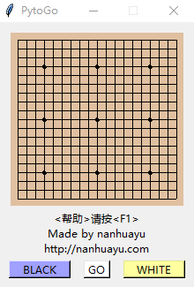
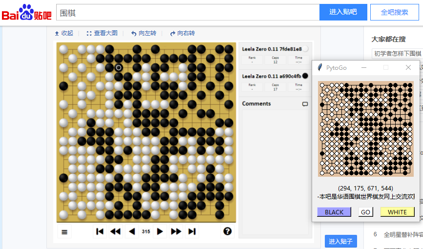

# PytoGo

### 目前程序正在返修过程中，很快会和大家见面~

* pytogo完美适用所有对弈软件，甚至所有网页版围棋棋盘。   
* 使用比cline更强大更精准的智能识图连线引擎，完美识别几乎所有截图围棋棋盘。   
* 比cline和gtools更方便易用，不易出错   

对于大多数棋谱截图图片，甚至模糊图片，都能精准识别。

## 使用帮助

* 选择black或者white截取屏幕。
* 截取棋盘屏幕(注意要比棋盘网格稍微大一点)。
* 点击play连线开始下棋。

## 注意事项
* 无法激活屏幕会连线失败。
* 打劫时注意先走一步再点play。
* 出现鼠标无法点击时请使用管理员权限

## 快捷键
* \<帮助\>按\<F1\>; 
* \<play\>按\<Return\>; 
* \<暂停\>按\<Ctrl+Q\>

## 其它
祝您使用愉快

您的赞助是对软件的最大鼓励！

## 联系作者
* QQ交流群 698721444
* nanhuayu@gmail.com

## 软件地址
https://github.com/nanhuayu/PytoGo'
